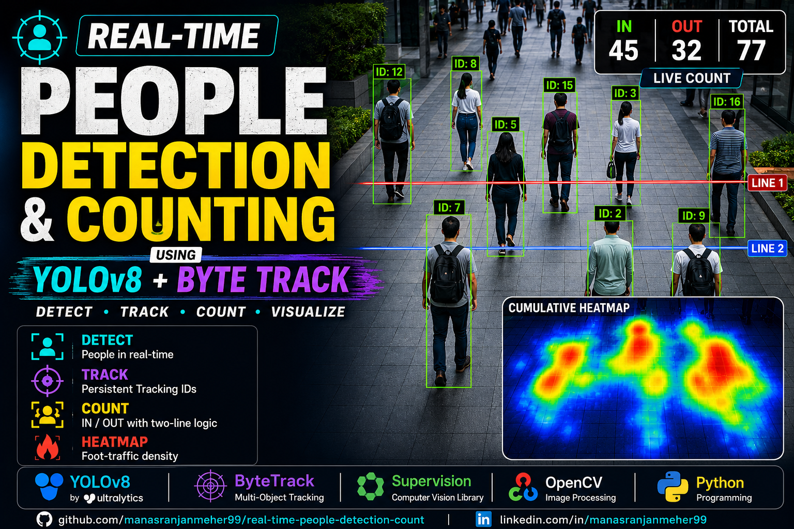

# 🚶 Real-Time People Detection & Counting using YOLOv8 + ByteTrack

A real-time computer vision project that detects, tracks, and counts people crossing a defined zone using **YOLOv8**, **ByteTrack**, **Supervision**, and **OpenCV**. The project also generates a cumulative heatmap to visualize foot-traffic density.

---

## 📸 Project Demo


<p align="center">
  
</p>

---

## ✨ Features

- 👤 Real-time people detection using YOLOv8
- 🎯 Multi-object tracking with ByteTrack
- 🆔 Persistent object IDs
- ↔️ Two-line IN/OUT counting logic
- 🔥 Foot-traffic heatmap generation
- 📊 Live counting statistics
- 📦 Video output generation

---

## 🛠️ Tech Stack

- Python
- OpenCV
- Ultralytics YOLOv8
- ByteTrack
- Supervision
- NumPy

---

## 📂 Project Structure

```text
real-time-people-detection-count/
│
├── output/
│   ├── heatmap.png
│   └── result.mp4
│
├── input.mp4
├── main.py
├── main.ipynb
├── yolov8s.pt
├── README.md
├── requirements.txt
├── .gitignore
└── thumbnail.png
```

---

## ⚙️ Installation

Clone the repository

```bash
git clone https://github.com/manasranjanmeher99/real-time-people-detection-count.git

cd real-time-people-detection-count
```

Install dependencies

```bash
pip install -r requirements.txt
```

---

## ▶️ Run

```bash
python main.py
```

---

## 📤 Output

The processed files are saved in the **output/** directory.

- ✅ result.mp4
- ✅ heatmap.png

---

## 💼 Applications

- Smart Surveillance
- Retail Analytics
- Crowd Monitoring
- Shopping Malls
- Airports
- Smart Cities
- Building Occupancy Analysis

---

## 🚀 Future Improvements

- Streamlit Dashboard
- Live Webcam Support
- Multi-Camera Tracking
- CSV Analytics Report
- Zone-based Analytics

---

## 👨‍💻 Author

**Manas Ranjan Meher**

GitHub: https://github.com/manasranjanmeher99
Linkedin: https://www.linkedin.com/in/manas-ranjan-meher-606181280/
